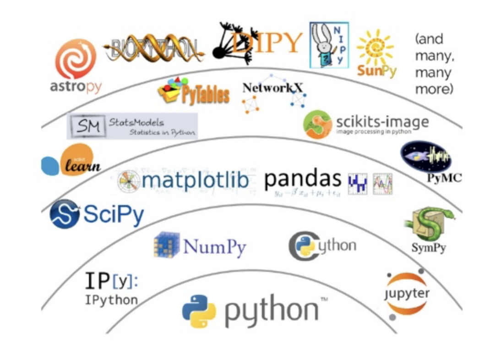

# Lesson — The Data Science Process and Roles

- Skills Course / Intro to Data Science
- Week 1 / Day 1
- 30 min

## Overview

## Associated curriculum

## Learning objectives

* Data Science Tools and Technologies
* Python Programming Language and rationale for adoption
* Basic data types (Strings, Numbers and Boolean) with coding exercises
* Python variable declaration, assignment and re-assignment with coding exercises
* Python user I/O with coding exercises

## Knowledge and understandings

## Misconceptions and difficult concepts

## Learning activities

Each coding exercise should be explained in about 10 minutes and another 20 minutes for students to try out the code.  provides a brief introduction to some of the programming environments used for data analysis including MATLAB, R and Python. Students will be provided with a rationale behind choosing python as a language of choice for data science experiments. This lesson then links to the coding exercises which have been developed by data science team at Flatiron to introduce basic programming concepts in Python including variable declaration and assignment, string and numerical data types and summing it all up with the song analysis experiment.

**Provide a comparison of major programming environments**, consult [Quora](https://www.quora.com/Between-R-MATLAB-and-Python-which-one-is-better-for-artificial-intelligence-data-science-and-research) and This excellent review [paper](https://www.google.com/url?sa=t&rct=j&q=&esrc=s&source=web&cd=2&ved=0ahUKEwior87c-p3bAhUHIsAKHcUiAIwQFggzMAE&url=http%3A%2F%2Fwww.jds-online.com%2Ffile_download%2F612%2F150%25E5%25AE%258C%25E6%2588%2590V.pdf&usg=AOvVaw3Kzd_dYVl66naduCjZr0HR) )

* Python is a general purpose language that is easy and intuitive whereas finding packages in R can take a lot time if you are not familiar with it. In short, if you have less time to code Python would be a better option.

* R has a rich ecosystem of cutting-edge packages and active community. CRAN (Comprehensive R Archive Network) is a huge R repository of R packages which is comparatively huge than PyPi(Python Package Index)

* R is more useful when the data analysis requires an individual server whereas Python is more useful when analysis is distributed and has to be incorporated into other apps.

* Python is a good tool to implement algorithms as it is a fully fledged programming language whereas R is preferable when statistical models have to be developed.

* Python is also used in Embedded Systems whereas R is moreover restricted to developing Statistical model to visualize data sets.

* R is comparatively slow, as it has so many open source packages(greater than Python).

* MATLAB uses proprietary algorithms, popular for Digital Signal & Image Processing in academic/research community.

* Mathworks (Matlab) puts restrictions on code portability, the ability to run your code on someone else's computer. You can run your “compiled” application using the Matlab Component Runtime (MCR), but your portable app must exactly match the version of the installed MCR, which can be a nuisance considering that Matlab releases a new version every 6 months.

* Matlab is quite expensive, which means that code that is written in Matlab can only be used by people with sufficient funds to buy a license.

*  Matlab might be easier for beginners, because the packages have nearly everything you need, while in Python you need to install extra packages and an IDE. It has a large scientific community; it is used on many universities.

### Python (introduction 15 mins)

**Provide a rationale for choosing Python over other languages**

Python is a general purpose programming language which is heavily being used by data scientists alongside R and MATLAB. Python is generally preferred as a tool of choice for data analysis for following reasons:

* Python is open source which reduces the cost of analysis as compared to proprietary solutions like MATLAB
* Python has a massive online community
* Comparatively easier to learn and program due to high level abstractions
* Python can handle different types of data ranging from structured data  e.g. relational databases, NoSQL, CSV, Jason, XML to unstructured data e.g. images, video and text
* Python has many package as suitable for simpler Analytics projects (eg. segmentation, cohort analysis, explorative analytics, etc.) as advanced Data Science projects (eg. building machine learning models)
* The industry is keen to hire data professionals with solid Python knowledge. It means knowing Python will be an extremely competitive element in your career development
* Python is applicable to the complete data science process from data collection, pre-processing to predictive modeling and visualizations.

(Provide examples of some of the data analysis specific libraries in Python)

You don't have to learn every functional offering by Python for data analysis. A basic understanding of datatypes offered by Python along with a clear understanding of Python syntax can allow you to start getting engaged into basic data analysis experiments. For advanced analysis, Python packages including SciPy, NumPy, Pandas, ScikitLearn and TensorFlow are popular choices for machine learning and deep learning experiments.

## What's next
